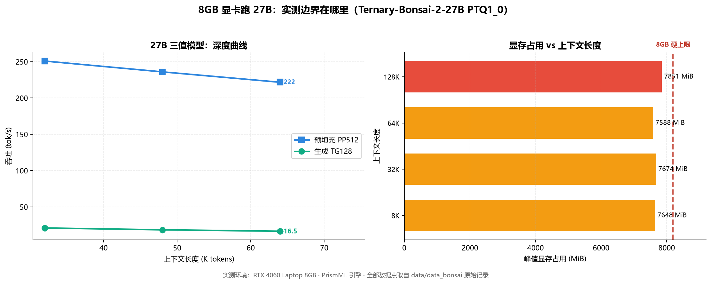

# Ternary-Bonsai-2-27B 三值 QAT · 8GB 笔记本实测（PrismML b10709）

> EN: Ternary-Bonsai-2-27B (PTQ1_0 QAT, 5.5GB) on 8GB laptop: PrismML b10709 vs b10685 A/B (+15% PP / +24% TG), quality gate, engine notes.

[](LICENSE)

**硬件**：RTX 4060 Laptop 8GB · 32GB DDR5 双通道 · Windows 11 · llama.cpp 系 fork

**量化**：**PTQ1_0 三值 QAT**（5.5 GB——27B 能塞进 8G 卡的唯一形态：PrismML 量化感知训练，非暴力压缩）

**引擎**：**PrismML b10709**（CUDA 静态链接；b10685→b10709 = PP +15% / TG +24%，A/B 实测）




**8GB 卡的实测边界**：左图是 27B 三值模型的深度曲线，右图各上下文配置的显存占用——128K 时已达 7851 MiB，紧贴 8GB 上限。原始数据见 `data/data_bonsai`。

## 生产配置（start.bat 即仓库内同名文件，零漂移）

```bat
-fa on --cache-prompt --ctx-checkpoints 8 --jinja + chat-template-kwargs enable_thinking=false（64K 甜点 / 96K 崩塌墙）
```

## 实测结果（服务端真实长提示口径）

| 项 | 数值 |
|---|---|
| PP @20K | 302 |
| TG @20K | 23.3 |
| 上下文 | 64K 甜点 / 96K 起崩塌 |
| 质量 | 9 题质量闸门全过（含工具调用） |

## 关键发现

- 三值 PTQ1_0 是 27B 在 8G 卡的唯一可用形态：暴力低比特（IQ1_S 实测）中文退化和行为崩坏，QAT 版没有这些问题。
- 引擎升级 A/B：b10685→b10709 同参同题 PP +15% / TG +24%（数据在 data/）。
- DFlash/DSpark 草稿在本 fork 全部加载失败（invalid vector subscript，文件级不兼容）——投机解码判死。
- env 开关 GGML_CUDA_PTQ1_0_MMQ_MAX_BATCH=64 是条件开关：显存高压（Docker 等在跑）会触发 Fallback 双引擎躺平，必须当天实测。
- peg-native 400 bug 与本引擎无关（PrismML 自有解析路径），多轮工具循环正常。

## 复现

```bash
python tools/depth_probe_atomic.py <模型.gguf> <端口> <标签> --depths 0,32768,65536,98304,118784 -ctk turbo4 -ctv turbo4 -b 2816 -ub 2816 --threads 24
python tools/test_engines.py
```

## data/ 与 tools/

`data/` 是全部实测数据（summary_*.txt 为权威深度/预填/矩阵总表，每行带时间戳，可复现）。
`tools/` 是探针与判分脚本（服务端真实长提示口径；llama-bench pp512 在本机与真实负载差 2.8 倍，仅作参考）。

## 姊妹仓库（同机同方法论）

- [ornith-1.5-35b-8g-tuning](https://github.com/rui08984-dot/ornith-1.5-35b-8g-tuning)
- [kat-coder-35b-8g-tuning](https://github.com/rui08984-dot/kat-coder-35b-8g-tuning)
- [qwen3.6-35b-8g-tuning](https://github.com/rui08984-dot/qwen3.6-35b-8g-tuning)
- [zhrp-gemma4-26b-8g-tuning](https://github.com/rui08984-dot/zhrp-gemma4-26b-8g-tuning)
- [ornith-9b-kvmem-8g-tuning](https://github.com/rui08984-dot/ornith-9b-kvmem-8g-tuning)

## 致谢

- [ggml-org/llama.cpp](https://github.com/ggml-org/llama.cpp) — 本体
- [TheTom/llama-cpp-turboquant](https://github.com/TheTom/llama-cpp-turboquant) — turbo4 KV 原始 fork
- [AtomicBot-ai/atomic-llama-cpp-turboquant](https://github.com/AtomicBot-ai/atomic-llama-cpp-turboquant) — 现用构建
- [PrismML](https://huggingface.co/PrismML) — Bonsai 三值 QAT
- KVMem — KV-in-RAM 超长上下文引擎

## License

MIT。模型权重遵循各自发布页许可。
